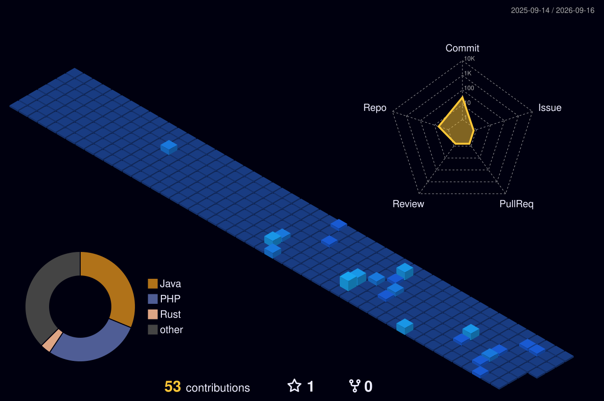

# 👋 Hello, I'm Pedro

## 🚀 Back-end & Full Stack Developer

Software Developer focused on scalable back-end applications, APIs, cloud solutions, and system integrations.

---

## 🧠 About Me

- 💻 Back-end Developer with experience in PHP, Python, Node.js, and Rust
- 🔌 Experience with RESTful APIs and gRPC architectures
- ☁️ AWS cloud deployment and integration
- 🗄️ Experience with MySQL, PostgreSQL, and Redis
- 🌎 Advanced English
- 📚 Postgraduate studies in:
  - Software Engineering
  - Multiplatform Application Development

---

## 🛠️ Tech Stack

### Languages

---

### Back-end

---

### Frameworks & Tools

---

### Databases

---

## 💼 Professional Experience

### Junior Software Developer — Transsat (2023 – 2025)

- Developed RESTful and gRPC APIs
- Built scalable back-end solutions using PHP, Rust, and Node.js
- Worked with Laravel and JavaScript applications
- Integrated MySQL, PostgreSQL, and Redis
- Assisted AWS deployment and maintenance

---

## 📊 GitHub Stats

---

## 🌌 3D Contribution Graph

---

## 📫 Contact

---

⭐ Always learning and building scalable solutions.
